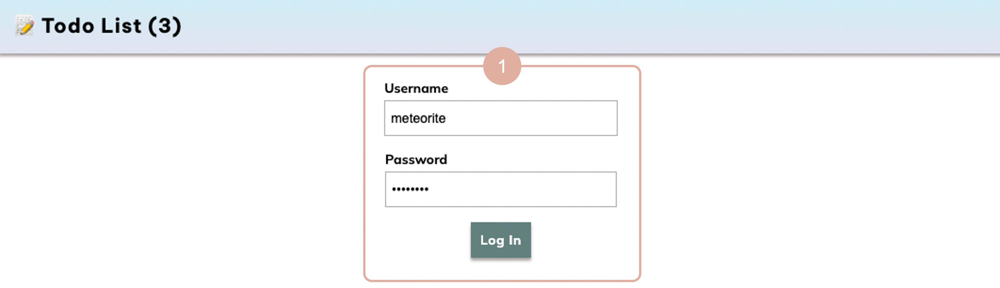
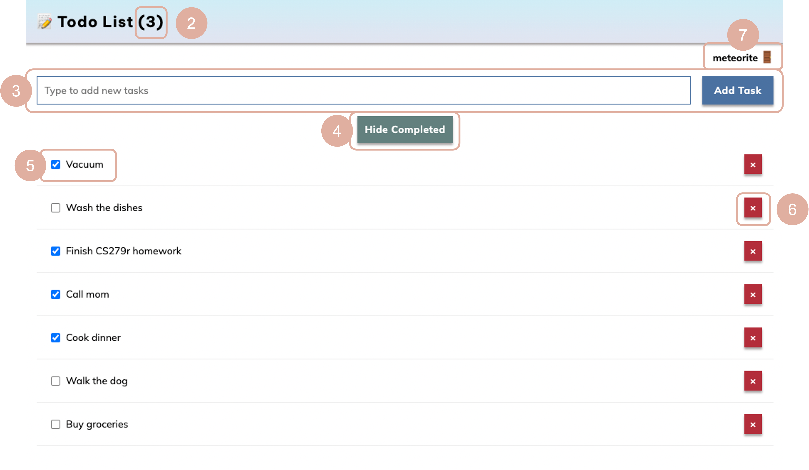

# todo7
Todo app made with meteor and svelte: [https://cyeh-todo-app.meteorapp.com/](https://cyeh-todo-app.meteorapp.com/)

- *Note:* the source code for the app is located in the [simple-todos-svelte](simple-todos-svelte) folder

## instructions
Open [webpage](https://cyeh-todo-app.meteorapp.com/) to start exploring. You will first be prompted with the login screen:


1. Here users can **login** to the app. Please use the following login info:
- *username*: ```meteorite```
- *password*: ```password```

Once you login, the main app should load. The app comes preloaded with a few todo items as an example.



*Try these features out!*

2. See the **number** of pending todos at the top of the screen
3. **Add** a new todo by typing into the input field & pressing the "Add task" button to add it to the list
4. **Hide/show** completed todos by toggling the "Hide completed" button
5. **Check/uncheck off** a todo by toggling the checkboxes to the left of each item
6. **Remove** todos by pressing the ```X``` icon to the right of each item
7. Finally, you can **logout** by pressing the username above the "Add task" button

## resources
I followed this [tutorial](https://svelte-tutorial.meteor.com/simple-todos/) to build my todo app with Svelte and Meteor, making modifications accordingly.
